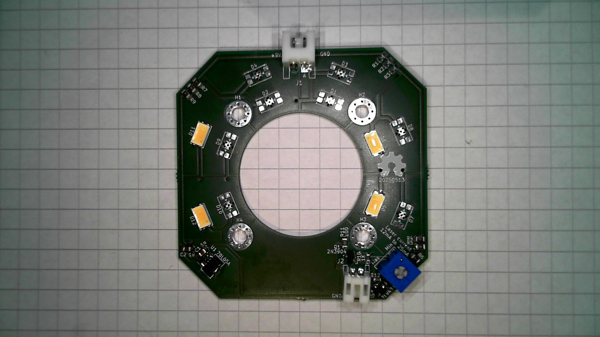

# Ikea Livecam holder LED ring
PCB with LEDS and cross laser powersupply for the Ikea lamp Microsoft Livecam microscope.
## Laser driver
The laser driver consists of a TL431 style constant current sink with a trimpotmeter to adjust the current and thus brightness. Most lasers have a constant current circuit integrated that runs of 5V but this makes it quite bright, overloading the camera in my soldering microscope. 

Values of 4.7K as low side set resistor and 5K trimpot gives a range of 12.5mA to 25.8mA using a shunt resistor of 100Ohm. You can substitute any 1.24V reference TL431 regulator. The TLV431 is used here. A 5V powersupply is also used for lasers that can be driven just by 5V signal, you can then omit the drive circuit and connect the relevant pin to ground.

For the LED series resistors I generally use 3*0805 resistors to spread out the heat a bit. Match to the amount of light you want
# TODO
There are some possible improvements but for now lets use it for a while, here are few improvements I have in mind:
* Change led positions, the inner positions are not useful.
* Move the power distribution trace to the inner side
* Change the series resistor to a dimmable LED driver
* Increase mounting hole size, it fits a 3d print that clamps around something, hole alignment will be a bit off
# BOM
* Osram high CRI LED in 5630 package, OSRAM DURIS
* LM78L05 in SOT89 housing
* TLV431 shunt regulator in SOT23 for laser current control (any 1.24Vref 431 would be suitable)
* Bourns trimpot 3362
# Result
Here is a partially assembled board that was used for tests and characterisation. Fun fact, this board is lit by an webcam that has fully assembled LED ring mounted to it.

I am using 3 parallel 0805 resistors of 150 Ohm to make a 50 Ohm resistor, this limits the current to 70ma at 9V running from a USB-C PD module. This gives plenty of light for my microscope microscope. I am driving my webcam LED's a bit harder with 3 0805 resistors of 120 Ohm to make a 40 Ohm resistor, this is a bit brighter but the leds stay at aroun 50 degrees celcius. They give a ton of light where it matters in front of the camera.

