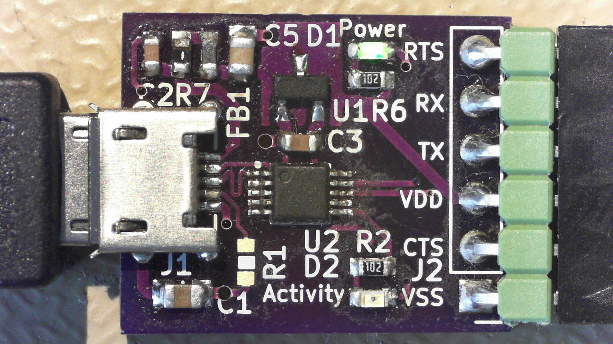

# Jiangsu Qin Heng CH340E module
Module board for the [CH340E](http://www.wch.cn/product/CH340.html) USB to serial converter. Advantage of the CH340E is its compact size and low cost, requiring a minimum of additional components.
## TODO's
Still some things need to be done:
* schematic entry
* PCB layout
* Review with one night in between
* Produce at [OSHPARK](https://oshpark.com/)
* Assemble
* Test & characterise
* update Readme.md with pictures and BOM
## BOM
The CH340E is available from various chinese shops but can also be found on [LCSC](https://lcsc.com/).
* CH340E, [C99652 from LCSC](https://lcsc.com/product-detail/USB_CH340E_C99652.html)
# Pictures

