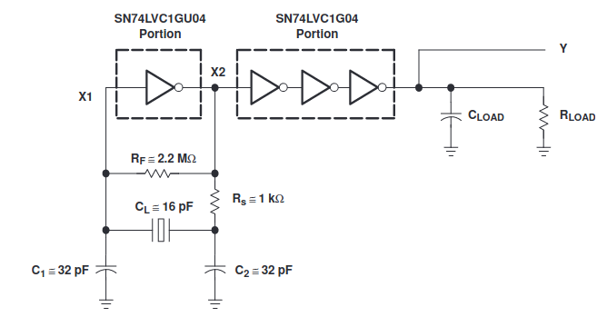
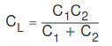
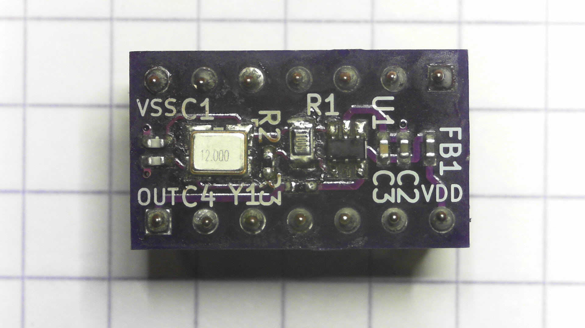

# Crystal oscillator
Small crystal oscillator PCB using the 1GX04 style pierce oscillator and driver logic IC. You can get the PCB from [OSHpark](https://oshpark.com/shared_projects/tEdkEFkm).
## TODO's
All finished!
## Usage
Most of the information here is taken from various datasheets from [Nexperia](https://assets.nexperia.com/documents/data-sheet/74LVC1GX04.pdf) and [Texas instruments](https://www.ti.com/product/SN74LVC1GX04).

### Rf
The feedback resistor needs to be high ohmic, for me it seems that 10MegOhms is sufficient, you can probably lower it. 
Nexperia has a good test procedure to prevent spurious oscillations by testing the circuit without a crystal and checking of nothing oscillates. This makes sure you have enough gain for oscillation but not for any spurious oscillations to occur.
### C1 and C2
The predominant formula seems to be like this:

### Rs
Rs is tricky, the datasheets recommend that you compute the impedance of C2 at the oscillation frequency to create a 50% divider with Rs. This seems to work for normal AT cut crystals.
But this does not work well for tuningfork crystals like those of 32.768KHz. Another rule of thumb I have read is to take the ESR and multiply it by 4. I am not sure where I got that one but does seem to do the trick for the tuning fork types.
### Example table
Crystal|Rf|C1 & C2| Rs
-------|--|-------|---
[Q13FC13500004 FC-135 32.768KHZ 12.5PF](http://www.farnell.com/datasheets/2018173.pdf)|10Mohm|15pF|220KOhm(see notes)
[MCSJK-7U-12.00-12-30-80-B-30](http://www.farnell.com/datasheets/2864166.pdf)|10Mohm|15pF|100Ohm
[XTY 7216-2500A2010-00 ](https://lcsc.com/product-detail/New-Arrivals_XTY-7216-2500A2010-00_C389792.html)|10MOhm|33pF|300Ohm
[XRCGB32M000F2P10R0](https://www.murata.com/products/productdata/8801079492638/SPEC-XRCGB32M000F2P10R0.pdf)|10MOhm|4.7pF|1KOhm

## BOM
* Any crystal in 3225 housing, you can also fit smaller crystals in that same footprint with some positioning
* any 1GX04 chip from nexperia or TI
* 0603/0805 high ohmic feedback resistor
* All other passives 0402
# Pictures

