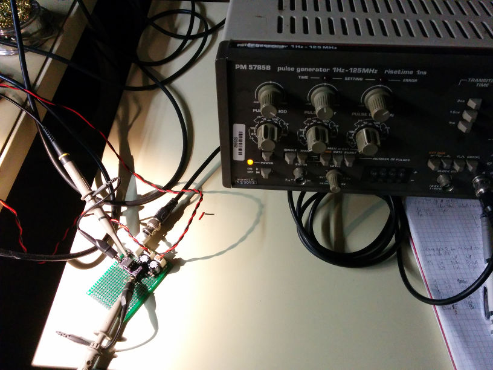
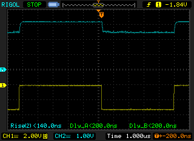
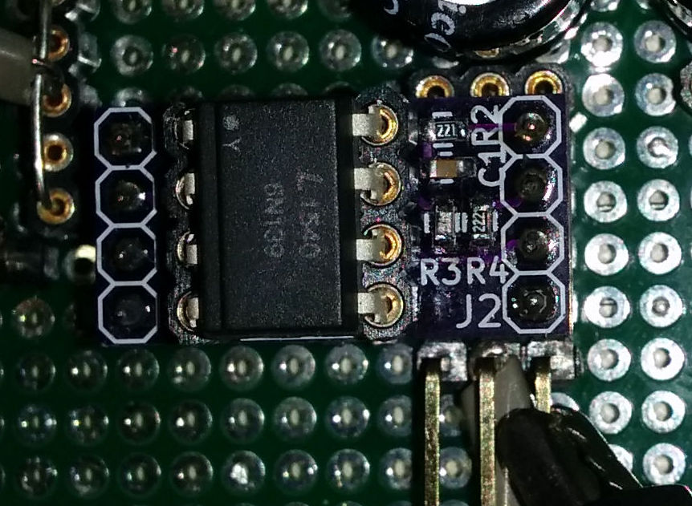

# 6N139 breakout #
This board is a simple 6N139 breakout board with footprints for all the supporting resistors. These where made to check this circuit and do some experiments. Maybe they are useful for people that want to galvanically digital signals on a budget. They can be ordered on [Oshpark](https://oshpark.com/shared_projects/U0MG0PbD).
## Usage ##
As I generally use 3.3V as much as possible for my projects. These boards have been made with that in mind. As the 6N139 darlington needs to be powered by 4.5V minimum, it has been brought out on a separate pin. The reason for the 220Ohm and 100nF network is to prevent noise coupling back onto the 5V rail. This is useful if you use this setup to couple a sensitive analog domain to a more noisy digital domain. Some projects of mine have a battery powered or highly isolated domain with 22bit ADC's and you want as little fast edges as possible to keep measurement noise down. R1, R3 and R4 values have been determined by the measurements described below.
## Measurement setup and resistor values ##
Some tests have been performed and the optimal resistor values have been determined for my application. Do perform comparable tests to see if they are in line with your expectations/requirements. I have tested these values with the Liteon 6N139's I bought from [reichelt](http://www.reichelt.nl/Optocouplers/6N-139/3/index.html?ACTION=3&GROUPID=3046&ARTICLE=2860&SEARCH=6n139&OFFSET=16&). 
My measurement setup is as follows:

* Philips PM 5785B pulse generator with a 1ns Risetime, Set up at around 100KHz.
* Philips PE 1542 DC powersupply 5V for VCC and 3.3V for I/O pull up voltage.
* Rigol DS1052E modified to 100MHz.

### Resistor values ###
There are 3 main resistors determining performance:

R1: Current limiting resistors for the optocoupler LED. This determines how heavely your output will be loaded. All measurements have been performed with a 1K resistor. The current draw is then around 2.1mA (assuming a led voltage drop of 1.2V).

R3: Base resistor, changes Delaytimes and influences risetime. Smaller resistors increase turn on time, decreases turn off. I have settled for 4.7K to be the best tradeoff with the 1K led resistor R1. The delay times become more or less symmetrical.

R4: Pull up resistor, changes off to on risetime. I have settled for 2.2K to keep the current consumption limited to around 2mA at 3.3V.

### Possible improvements ###
Add a PNP risetime accelerator transistor to improve risetime performance, but this would add complexity. Best to check if your peripherals/devices can handle such slow slopes, or use a separate shmitt trigger to improve risetimes.
### Measurement results ###

Big difference with a china "fairchild" opto.

## Assembled pictures ##

